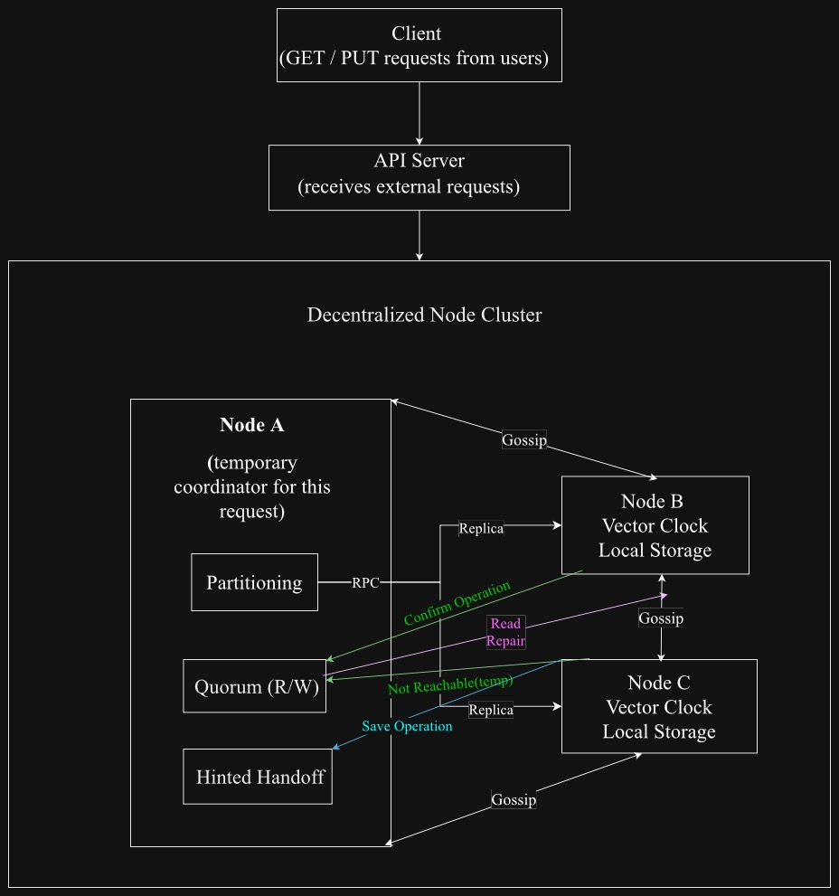

# CSC4160 Final Report : A Gossip-based Distributed Key-Value Storage System

> Tingxuan Liu 123090363@link.cuhk.edu.cn
>
> Yuxuan Liu 123090377@link.cuhk.edu.cn

##### Demo video link: [Demo Video](https://www.bilibili.com/video/BV1z5mvB2EGh/?spm_id_from=333.1387.list.card_archive.click&vd_source=2c548de46de64efbaea8a76009b6e42a)

##### Source code: [DynamoKV](https://github.com/A-lbum/DynamoKV)

------

## 1. Motivation

**Distributed key-value storage system** plays a central role in modern cloud and web-scale systems. Among existing designs, **Amazon’s Dynamo** demonstrates exceptional performance in achieving high availability, partition tolerance, and elastic scalability in real production environments (DeCandia et al., 2007). Its success highlights the importance of decentralized architectures that avoid single points of failure and continue operating effectively under node outages or network partitions.

Motivated by these insights, we aims to build a system prototype that captures the essential characteristics of Dynamo. It provides horizontal scalability through partitioned data storage and maintains high availability by storing multiple copies of data. The system also offers eventual consistency and adapts to workload changes with dynamic node join and leave. Moreover, it also manages cluster membership and preserves write availability even when nodes temporarily fail. Together, our system captures the mechanisms that make modern cloud storage systems robust and scalable in those dynamic, failure-prone environments.

## 2. Overrall Approach and System Architecture

For an arbitrary sample request ,the system work as follows:



### 2.1 Decentralized Structure

When the client asks a request, the API sever will reseive it and send it to **one of the nodes in the decentralized cluster**. We ensure all nodes in the cluster are **functionally equivalent** and all have storage capacity, coordination capacity. Thus, any node  receives the request  can serve as a temporary "coordinator". If any node goes down, other nodes can immediately take over its coordinating role, this ensures a high availability and fault tolerance. The current "coordinator" node handle the following tasks:

#### a. Partitioner 

The partitioner will determine the which N nodes to send replications with **consistent hashing**.

#### b. Quorum(R/W) and Hinted Handoff

Read operations (R) and write operations (W) must be confirmed by at least R and W nodes among the N replicas to be successful. This make the system can continue to operate even when some nodes go down.  If a replica node is unreachable, the coordinator **stores the write locally as a “hint”**, together with metadata indicating which node should eventually receive it. Later, when the failed replica recovers, the node holding the hint forwards the stored write to the recovered replica, completing the handoff.  These mechanisms supports eventual consistency and avoid the system blocking on a failures.

#### c. Vector Clocks and Conflict Resolution

Each write is tagged with a **vector clock** to track causal history. When multiple versions exist, the system uses vector clocks to detect **concurrent updates**. Versions that are causally dominated are discarded, while concurrent versions are kept as **siblings**. Clients can then resolve conflicts and write back a merged value. This mechanism ensures **eventual consistency** while allowing concurrent writes without data loss.

### 2.2 The Gossip Moudle

The gossip module maintains a decentralized and continuously updated view of cluster membership. Each node **periodically exchanges membership information with a small subset of other nodes**, allowing changes such as  dynamical node joins, leaves, and failures to propagate gradually throughout the system.

## 3. Design and Inplementaion Details

In our inplementation, we first build and validate a standalone single-node key-value store with a well-defined storage interface and gRPC service. Then we extend this foundation into a fully distributed, Dynamo-style system by adding cluster membership, data partitioning, replication, and fault-tolerance mechanisms.

### 3.1 Standalone Implementation

The following functions form the critical execution path from gRPC requests to the underlying storage engine and define the fundamental semantics of key-value operations(Get, Put, Delete). Take Put as an example:

```go
func (server *Server) RawPut(ctx context.Context, req *rawkv.RawPutRequest) (*rawkv.RawPuttResponse, error)
```

These funtions interact with the the following storage interface to perform operations:

```go
func (s *StandAloneStorage) Write(batch []storage.Modify) error {}
func (s *StandAloneStorage) Reader() (storage.StorageReader, error) {}
```

This separation cleanly decouples request handling logic from the underlying storage engine, enabling modularitycand extensibility.

### 3.2 Distributed System Extension

#### a. Partitioner

When extending to a distributed system, we first need a partitioner to distribute the keys across the cluster and balance  the workload. Here, we use **consistent hashing**, since its ring structure can minimize data movement (only a few nodes need to change state) when nodes join or leave.

```go
type Partitioner struct {
  mu     sync.RWMutex
  ring   []vnode // sorted by Hash
  nodes  map[NodeID]struct{}
  vnodes int 
}
```

#### b. Communication Protocol for Metadata

To maintain a fully decentralized architecture, nodes exchange metadata using a **gossip-based communication protocol**, avoiding any centralized membership service. Gossip provides scalable and fault-tolerant dissemination, allowing nodes to gradually converge to a consistent view of the cluster through periodic peer-to-peer exchanges.

Each node exposes a gossip endpoint for pushing and receiving cluster state:

```go
func (s *NodeServer) PushGossip(ctx context.Context, st *pb.GossipState)
(*pb.GossipResponse, error) {}
```

Gossip messages carry lightweight node state metadata, including node identity, liveness information, and a monotonically increasing heartbeat. By comparing heartbeats and liveness flags, nodes can detect joins, failures, and recoveries. Batched state exchange enables efficient synchronization of membership information even under partial failures or network delays.

#### c. Fault Tolerance

As mentioned in part2, we use **Quorum(R/W) and Hinted Handoff** for fault tolerance and eventual consistency. For example, if there are less than R replicas responded successfully:

```Go
if successes < c.R {
    return collected, fmt.Errorf("read quorum not reached: %d/%d", successes, c.R)
}
```

If some node is currently not reachable, it will be  stored as a hint in the buffer of other nodes:

```Go
c.handoff.StoreHint(node, &pb.Hint{
    Key:        key,
    Data:       vv,
    TargetNode: node,
})
```

#### d. Conflict detection and resolution

**Concurrent read and write operation** and the above two mechanism may lead to **multiple version** of same key on different replicas, so we need a **vector clock** to judge the relationship between different versions and then merge the correct version into all replicas:

```Go
func CompareVC(a, b *pb.VectorClock) int {}
func MergeVC(clocks ...*pb.VectorClock) *pb.VectorClock {}
```

#### e. gRPC Communication Framework

Finally, with gRPC framework handling network transmission, serialization, and invocation mechanisms, we can  combine all the things above together to get a distributed key-value storage system. 

```protobuf
service DynamoRPC {
    rpc InternalPut(InternalPutRequest) returns (InternalPutResponse);
    rpc InternalGet(InternalGetRequest) returns (InternalGetResponse);
    rpc SendHints(HandoffBatch) returns (HandoffAck);
    rpc PushGossip(GossipState) returns (GossipResponse);
    rpc FetchHints(FetchHintsRequest) returns (HandoffBatch);
}
```

### 3.3 Deployment with Docker 

In production environments, distributed storage systems are typically deployed on **virtual machines or physical hosts** to achieve strong fault and performance isolation. In this project, we adopt **container-level isolation** as a lightweight deployment abstraction, which allows us to efficiently emulate multiple independent storage nodes and focus on validating replication, quorum, and consistency mechanisms. The system architecture itself is independent of the isolation mechanism and can be deployed on VM-based infrastructures without modification.

## 4. Evaluation

### **4.1 Component-level Unit Tests**

We implemented a comprehensive suite of unit tests to validate the correctness of core components in isolation. These tests focus on deterministic behavior, fault handling, and correctness of internal mechanisms. All unit tests pass successfully, providing strong evidence that individual components behave correctly and deterministically under expected conditions. For the test details, you can refer to the `_test.go` files under the directory `path/to/source/code/distributed_core`.

**Partitioning and Replica Selection.** Tests such as `TestPartitionerBasic`, `TestDeterminism`, `TestDistribution`, `TestMinimalMovement`, `TestReplicaUniqueness`, `TestReplicaOverflow, TestRingOrdering`, and `TestRemoveNode` verify the consistent hashing–based partitioner. The results confirm that replica selection is deterministic, evenly distributed, avoids duplicates, and minimizes data movement under node joins and removals.

**Coordinator and Quorum Logic.** Tests including `TestPutGetAndHinting`, `TestGetReplicaSelectionDeterminism`, and `TestDynamicJoinAndLeave` validate the coordinator’s ability to correctly select replica sets and enforce quorum constraints under membership changes.

**Hinted Handoff and Recovery.** `TestHintedHandoffAndRecovery`, `TestInternalPutHintedHandoff`, and `TestSendHintsAndPushGossip` verify that writes to unavailable replicas are stored as hints and correctly replayed once the target node recovers.

**Versioning and Conflict Handling.** `TestInternalPutMultipleVersions` and `TestMergeVersionedValues_DominatedAndConcu` validate vector clock comparison, concurrent version preservation, and dominated-version elimination.

### **4.2 End-to-End System Experiments**

To evaluate system-level behavior, we conducted an end-to-end demo using multiple in-process nodes coordinated via RPC. The demo consists of five scenarios, each designed to exercise a key Dynamo-style mechanism. For the experiment details, you can refer to our demo video and `demo.go` under the directory `path/to/source/code/distributed_core`.

**Basic Replication and Quorum.** We first initialize 3 nodes `n1`, `n2`, `n3`. With three nodes alive, a `PUT` operation (k1 = v1) is replicated to the preferred replica set (N=3, W=2). Readsfrom all nodes return the same value, confirming correct quorum writes and consistent reads.

**Dynamic Node join.** After node `n4` joins, the coordinator updates the replica set, A subsequent `PUT` writes data to the new nodeand reads from n4 return the latest value, demonstrating seamless membership changes.

**Node Failure and Hinted Handoff. ** When node `n2` fails, writes targeting it trigger hinted handoff. The system continues to accept writes using asloppy quorum, and hints are stored on healthy nodes, ensuring availability despite failures.

**Node Recovery.** Upon recovery of `n2`, stored hints are replayed automatically. A read from `n2` returns the latest valueshowing that the system restores replica consistency without manual intervention.

**Concurrent Writes and conflict Resolution.** Two concurrent PUTs to the same key generate multiple versions tracked by vector clocks. After resolvingthe conflict and writing a merged value, all replicas converge to a single version, demonstrating correcthandling of concurrent updates and eventual consistency.

## References

1. DeCandia, G., Hastorun, D., Jampani, M., Kakulapati, G., Lakshman, A., Pilchin, A., ... & Vogels, W. 
(2007). Dynamo: Amazon's highly available key-value store. ACM SIGOPS operating systems review, 
41(6), 205-220.